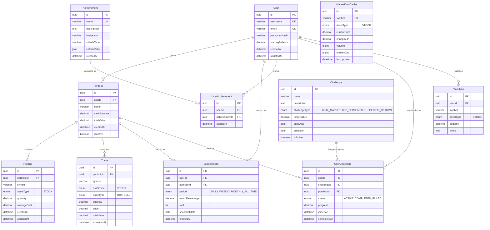

# Database Schema - Entity Relationship Diagram

This document contains the Mermaid ERD diagram for the Stock Trading Simulation database schema.

## Entity Relationship Diagram

## Key Relationships

### User Relationships
- **User → Portfolio**: One user can have multiple portfolios (1:N)
- **User → Leaderboard**: One user can have multiple leaderboard entries across different periods (1:N)
- **User → UserAchievement**: One user can earn multiple achievements (1:N)
- **User → UserChallenge**: One user can participate in multiple challenges (1:N)
- **User → Watchlist**: One user can watch multiple assets (1:N)

### Portfolio Relationships
- **Portfolio → Holding**: One portfolio contains multiple holdings (1:N)
- **Portfolio → Trade**: One portfolio executes multiple trades (1:N)
- **Portfolio → Leaderboard**: One portfolio can be ranked in multiple leaderboard periods (1:N)
- **Portfolio → UserChallenge**: One portfolio can be used in multiple challenges (1:N)

### Achievement & Challenge Relationships
- **Achievement → UserAchievement**: One achievement can be earned by multiple users (1:N)
- **Challenge → UserChallenge**: One challenge can have multiple participants (1:N)

## Unique Constraints

1. **User**
   - `username` (unique)
   - `email` (unique)

2. **Holding**
   - `(portfolioId, symbol)` - Each portfolio can only have one holding per symbol

3. **MarketDataCache**
   - `symbol` (unique) - Only one cache entry per symbol

4. **Achievement**
   - `name` (unique)

5. **UserAchievement**
   - `(userId, achievementId)` - User can only earn each achievement once

6. **Watchlist**
   - `(userId, symbol)` - User can only watch each symbol once

7. **UserChallenge**
   - `(userId, challengeId)` - User can only participate in each challenge once

## Indexes

### Performance Optimization Indexes

**User Table:**
- `email` - For login lookups
- `username` - For profile lookups

**Portfolio Table:**
- `userId` - For fetching user's portfolios

**Holding Table:**
- `portfolioId` - For fetching portfolio holdings
- `symbol` - For symbol-based queries

**Trade Table:**
- `portfolioId` - For fetching portfolio trade history
- `executedAt` - For time-based queries
- `symbol` - For symbol-specific trade history

**MarketDataCache Table:**
- `symbol` - For quick price lookups
- `assetType` - For filtering by asset type

**Leaderboard Table:**
- `(period, rank)` - For leaderboard queries
- `snapshotDate` - For historical leaderboards
- `userId` - For user leaderboard history

**UserAchievement Table:**
- `userId` - For fetching user's achievements

**UserChallenge Table:**
- `userId` - For fetching user's challenges
- `challengeId` - For fetching challenge participants

**Watchlist Table:**
- `userId` - For fetching user's watchlist

## Cascade Deletion Rules

All foreign key relationships use `onDelete: Cascade`, meaning:

- Deleting a **User** will delete all their:
  - Portfolios
  - Leaderboard entries
  - UserAchievements
  - UserChallenges
  - Watchlist items

- Deleting a **Portfolio** will delete all its:
  - Holdings
  - Trades
  - Leaderboard entries
  - UserChallenge associations

- Deleting an **Achievement** will delete all:
  - UserAchievement records

- Deleting a **Challenge** will delete all:
  - UserChallenge records

## Enums

### AssetType
- `STOCK` - Stock assets only

### TradeType
- `BUY` - Purchase order
- `SELL` - Sell order

### LeaderboardPeriod
- `DAILY` - Daily rankings
- `WEEKLY` - Weekly rankings
- `MONTHLY` - Monthly rankings
- `ALL_TIME` - All-time rankings

### ChallengeType
- `BEAT_MARKET` - Beat market benchmark
- `TOP_PERCENTAGE` - Rank in top percentage
- `SPECIFIC_RETURN` - Achieve specific return target

### ChallengeStatus
- `ACTIVE` - Challenge in progress
- `COMPLETED` - Challenge successfully completed
- `FAILED` - Challenge failed
